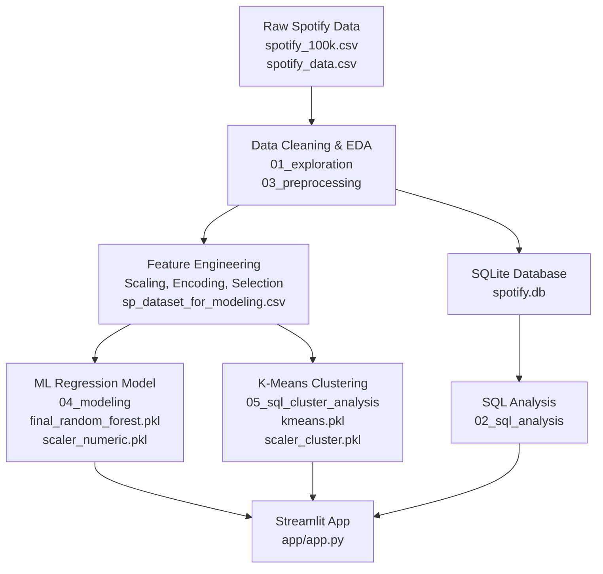

# 🎧 Spotify Popularity Prediction  
A Data Management, SQL Analytics, and Machine Learning Project


---

## 📌 Overview

This project analyzes a large Spotify music dataset to explore **song characteristics**, perform **SQL-based analytical queries**, clean and transform data, and build **machine learning models** that predict track popularity.  
It incorporates all three required course components:

- **Data Management**: cleaning, preprocessing, SQLite relational database  
- **Machine Learning**: regression modeling, clustering (K-Means), feature scaling  
- **Application Layer**: Streamlit application for interactive usage  

The repository also includes comprehensive **Jupyter notebooks** for exploration, SQL analysis, and modeling.

---

## 🧱 Project Architecture




---

## 📁 Folder Structure

```
├── app
│   └── app.py
├── data
│   ├── cleaned
│   │   ├── sp_dataset_for_modeling.csv
│   │   └── spotify_cleaned.csv
│   ├── raw
│   │   ├── spotify_100k.csv
│   │   └── spotify_data.csv
│   └── spotify.db
├── docs
│   ├── data_dictionary.md
│   └── data_overview.md
├── models
│   ├── feature_columns.txt
│   ├── final_random_forest.pkl
│   ├── kmeans.pkl
│   ├── scaler_cluster.pkl
│   └── scaler_numeric.pkl
├── notebooks
│   ├── 01_exploration.ipynb
│   ├── 02_sql_analysis.ipynb
│   ├── 03_preprocessing.ipynb
│   ├── 04_modeling.ipynb
│   └── 05_sql_cluster_analysis.ipynb
├── README.md
└── requirements.txt
```

---

## ⚙️ Installation & Setup

### 1. Clone the repository

```bash
git clone https://github.com/YOUR_USERNAME/Spotify_Popularity_Prediction.git
cd Spotify_Popularity_Prediction
```

### 2. Create a virtual environment(optional)

```bash
python3 -m venv venv
source venv/bin/activate    # macOS/Linux
venv\Scripts\activate       # Windows
```

### 3. Install required dependencies

```bash
pip install -r requirements.txt
```

---

## 📦 Handling Large Model Files (Critical Section)

This project requires several pre-trained models stored in:

```
models/
    final_random_forest.pkl
    kmeans.pkl
    scaler_numeric.pkl
    scaler_cluster.pkl
```

Because these files can be large, **two supported methods** are provided.

---

### **Option A — Git LFS (if your repo uses LFS)**

If you cloned using Git LFS:

```bash
git lfs install
git lfs pull
```

This will automatically download the `.pkl` files into the `models/` folder.

---

## ▶️ Running the Streamlit App

Once model files and dependencies are installed:

```bash
streamlit run app/app.py
```

The app provides:

- Popularity prediction on input song features  
- Exploration of cleaned dataset  
- Display of clustering insights  
- SQL-driven analytics visualizations  

---

## 📊 Notebooks Overview

| Notebook | Purpose |
|---------|---------|
| **01_exploration.ipynb** | Exploratory data analysis on raw data |
| **02_sql_analysis.ipynb** | SQL queries and analytics on `spotify.db` |
| **03_preprocessing.ipynb** | Cleaning, feature engineering, scaling |
| **04_modeling.ipynb** | Training Random Forest model and saving `.pkl` files |
| **05_sql_cluster_analysis.ipynb** | K-Means clustering with SQL integration |

All notebooks are optional for running the app — models are pre-trained.

---

## 🛠 Technologies Used

- **Python 3.10+**  
- **Pandas / NumPy / Scikit-Learn**  
- **SQLite** for relational data analysis  
- **Matplotlib / Seaborn** for visualizations  
- **Streamlit** for the interactive application  
- **Git LFS** for managing large model artifacts  

---

## 🚀 Future Improvements

- Deploy app version online (Streamlit Cloud)  
---

## 👥 Contributors

- Keerthana Venkatesan  


